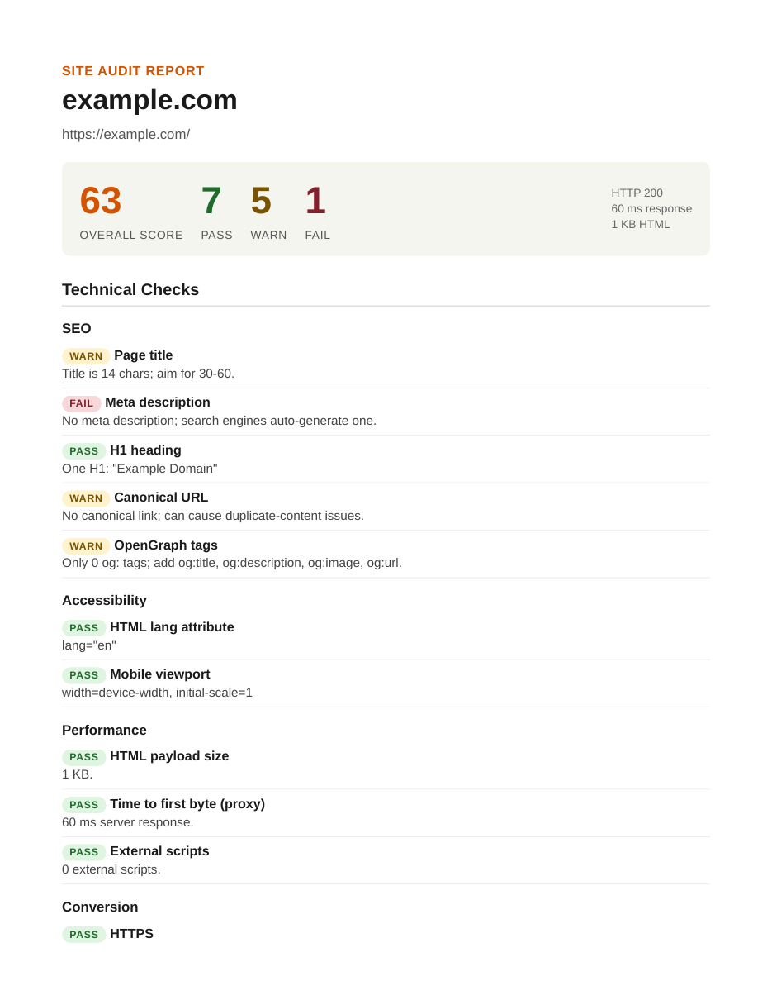

# AI Site Auditor

**One command turns any URL into a client-ready PDF site audit.** Built for agencies, freelancers, and sales teams who need a credible first-call deliverable for a prospect's website without spending an hour clicking through Lighthouse and writing it up by hand.

## The problem

A website audit is the standard opener in a web or marketing sales conversation, and it is almost always done by hand: open the site, run a few browser tools, screenshot the failures, retype them into a document. That takes 30 to 60 minutes per prospect, the checks drift depending on who ran them, and the output quality depends on the writer's mood. The two hard parts pull in opposite directions: the technical findings must be objectively true and reproducible, while the narrative around them has to be readable by a non-technical buyer. This tool splits those jobs, giving the measurable checks to deterministic code and only the framing to a language model.

## What comes out

```bash
$ python audit.py https://example.com --no-llm --out examples/audit_example_com.pdf
[1/4] Fetching https://example.com ...
      HTTP 200 | 1 KB | 60 ms
[2/4] Running deterministic heuristics ...
      score=63 pass=7 warn=5 fail=1
[3/4] LLM enrichment skipped (--no-llm).
[4/4] Rendering PDF to examples/audit_example_com.pdf ...
      Done in 0.2s.
```

That exact run produced the bundled artifact below ([full PDF](examples/audit_example_com.pdf), heuristics-only mode):

<p align="center">
  
</p>

Every line in "Technical Checks" traces back to a measured signal (13 of them on this page), and the score is a transparent formula, not a black box: `100 - 5 per warn - 12 per fail`, floored at 0. With an API key set, a "Strategic Findings" section is added on top of the same measurements.

## How it works

| Stage | Module | What it does |
| --- | --- | --- |
| 1. Fetch | `auditor/fetch.py` | Retrieves the URL, records status, latency, payload size, headers, and the parsed DOM |
| 2. Heuristics | `auditor/heuristics.py` | Deterministic checks: SEO (title, meta description, H1, canonical, OpenGraph), accessibility (alt-text coverage, `lang`, viewport), performance (HTML size, TTFB proxy, script count), conversion (HTTPS, CTA verbs, lead-capture forms). Aggregated to a 0 to 100 score with pass/warn/fail counts |
| 3. LLM enrichment | `auditor/llm.py` | Claude receives the heuristic results plus a content excerpt and returns a fixed JSON schema: executive summary, biggest opportunity, 5 to 7 categorized findings with severity and recommendation, and a 3-step next-actions list |
| 4. Render | `auditor/render.py` + `templates/report.html` | Jinja2 plus WeasyPrint produce a branded PDF, server-side and deterministic, no manual editing |

Two design choices are worth calling out. **Deterministic plus generative:** the heuristics give the audit a verifiable backbone, and the model layer is allowed to add framing and recommendations but is never trusted to invent metrics it cannot see. **Schema-enforced output:** the model call returns JSON, not prose, so the template stays stable and the model or prompt can change without breaking the renderer.

## Setup

```bash
pip install -r requirements.txt
export ANTHROPIC_API_KEY=sk-...   # optional
python audit.py https://example.com
```

Without a key, the tool runs in heuristic-only mode and simply omits the strategic-findings section (this is what `--no-llm` forces). WeasyPrint needs its usual system libraries (`libpango`, `libcairo`) for PDF rendering.

## Status and honest limits

| Item | State |
| --- | --- |
| Maturity | Prototype, roughly 560 lines including the PDF template |
| Automated tests | None yet, the bundled `examples/` PDF is the only regression reference |
| Coverage | Single page per run (the URL given), no crawl, no sitemap traversal |
| Rendering | Static HTML only, no headless browser, so JavaScript-rendered content is invisible to the checks |
| Performance signals | TTFB proxy and HTML payload size only, not Core Web Vitals or real user metrics |
| Timing claim | The run above completed in 0.2 s in heuristic-only mode; end-to-end time with the model call has not been benchmarked |
| Eval | A set of hand-audited sites under `examples/` would allow prompt iteration against ground truth and gating model bumps on regression. Not built yet |

## File layout

```
ai-site-auditor/
├── audit.py                  CLI entrypoint
├── requirements.txt
├── auditor/
│   ├── fetch.py              HTTP + parse
│   ├── heuristics.py         Deterministic checks + scoring
│   ├── llm.py                Model call + JSON schema
│   └── render.py             Jinja2 + WeasyPrint
├── templates/
│   └── report.html           Branded PDF template
└── examples/
    └── audit_example_com.pdf Sample output
```

Author: Yusuf Guenena (yusuf.a.guenena@gmail.com).
